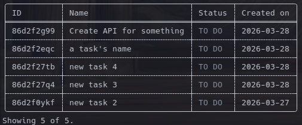
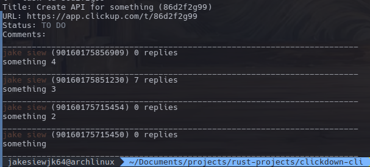

## Description

Simple CLI application to interface with ClickUp APIs.

Built for my own use but feel free to try.

## Features

- [x] List workspaces, spaces, folders, lists, task and task details.
- [x] List task comments and threads.
- [x] Update task status.
- [x] Update task title.
- [x] Filter task by status or title.
- [x] Add task comment.
- [x] Create a task.
- [ ] (optional) Pagination.
- [x] (optional) Respond to comments.
- [ ] (optional) Render images to terminal.
- [x] (optional) Assign members to task.
- [ ] (optional) Caching because each call is expensive if the task list is long.

## Usage

```
CLI application to interface with ClickUP APIs.

Usage: clickdown-cli [OPTIONS]

Options:
      --token <TOKEN>          [default: ""]
      --modify <MODIFY>        [possible values: status, name, comment]
      --add <ADD>              [possible values: task]
      --delete <DELETE>        [possible values: alias]
      --team-id <TEAM_ID>      [default: ""]
  -s, --space-id <SPACE_ID>    [default: ""]
  -f, --folder-id <FOLDER_ID>  [default: ""]
  -l, --list-id <LIST_ID>      [default: ""]
  -t, --task-id <TASK_ID>      [default: ""]
      --status <STATUS>        if provided, filters tasks by status [default: ""]
      --search <SEARCH>        if provided, filters tasks by search query [default: ""]
      --assignee <ASSIGNEE>    if provided, filters tasks by asignee currently filtering by only 1 assignee supported [default: ""]
      --thread-id <THREAD_ID>  if provided, gets comments for a thread [default: ""]
      --alias <ALIAS>          if provided, saves request to given name [default: ""]
      --list-alias             if provided true, prints all saved aliases
      --run <RUN>              if provided, executes a stored alias, does nothing if no matches found [default: ""]
      --alias-id <ALIAS_ID>    [default: ""]
  -h, --help                   Print help
  -V, --version                Print version

```

## Screenshots

### Task List:



### Task details:


